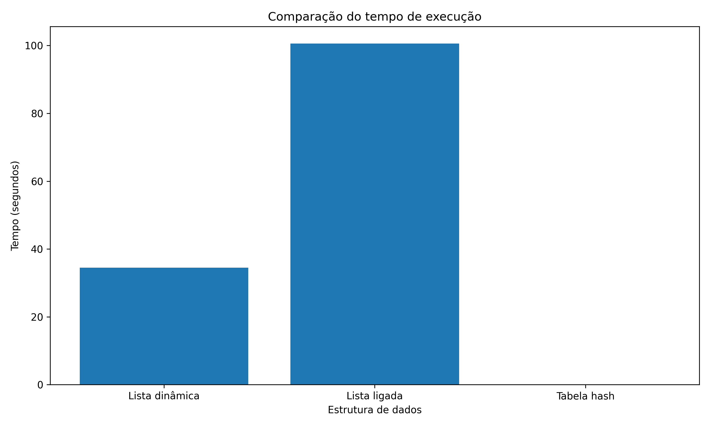
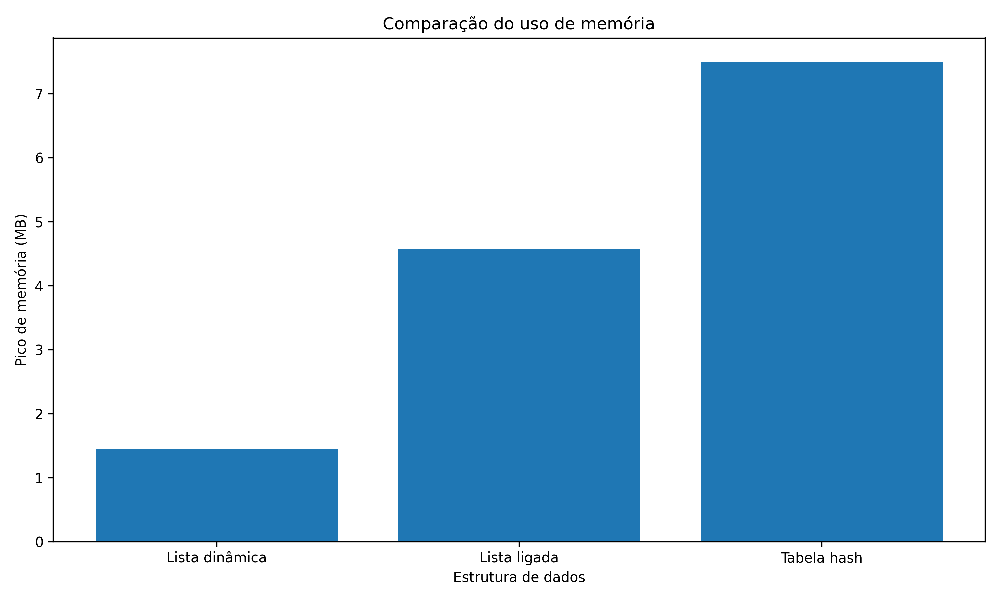
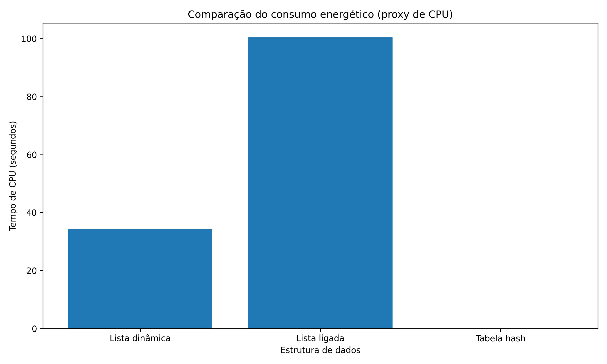

# 🌱 Checkpoint 1 – Estruturas de Dados e Consumo Energético


Projeto acadêmico desenvolvido para a disciplina **Energias Renováveis e Sustentabilidade**.

---

# 👨‍🎓 Identificação

**Aluno:** Lincoln Pereira  
**RM:** 567284  
**Turma:** 1CCPS  
**Professor:** Profº Roberto Torres Vaver  
**Atividade:** Checkpoint 1  

---

# 🎯 Objetivo do trabalho

Este projeto analisa como diferentes **estruturas de dados** impactam o desempenho computacional e o consumo energético estimado de um sistema.

Foram comparadas três estruturas implementadas em **Python**:

1️⃣ **Lista dinâmica** (`list`)  
2️⃣ **Lista ligada** (implementação manual)  
3️⃣ **Tabela hash** (`dict`)  

Cada estrutura executa:

- **100.000 inserções**
- **50.000 buscas**
- **20.000 remoções**

Durante a execução são analisadas:

- ⏱ Tempo de execução
- 🧠 Uso de memória
- ⚡ Consumo energético estimado (proxy baseado em tempo de CPU)

---

# 📊 Resultados

Os resultados são apresentados em três gráficos comparativos.

## Tempo de execução



## Uso de memória



## Consumo energético estimado



---

# 📄 Relatório acadêmico

O relatório completo do trabalho está disponível no PDF abaixo:

📄 

O documento contém:

- Introdução e contextualização
- Metodologia utilizada
- Gráficos gerados pelo benchmark
- Discussão dos resultados
- Respostas às perguntas da atividade
- Conclusão

O arquivo em **LaTeX (ABNT)** também está disponível para referência:

```
checkpoint1/relatorio/checkpoint1_relatorio_abnt.tex
```

---

# 📁 Estrutura do projeto

```
checkpoint1
│
├── README.md
├── requirements.txt
│
├── codigo
│   ├── lista_dinamica_benchmark.py
│   ├── lista_ligada_benchmark.py
│   ├── tabela_hash_benchmark.py
│   ├── gerar_graficos.py
│   └── executar_tudo.py
│
├── graficos
│   ├── grafico_tempo.png
│   ├── grafico_memoria.png
│   └── grafico_energia.png
│
└── relatorio
    ├── checkpoint1_relatorio.pdf
    └── checkpoint1_relatorio_abnt.tex
```

---

# ⚙️ Requisitos

Python **3.10 ou superior**

Verifique com:

```bash
python3 --version
```

---

# 📦 Instalação

Criar ambiente virtual:

Linux / macOS

```bash
python3 -m venv .venv
source .venv/bin/activate
```

Windows

```bash
python -m venv .venv
.venv\Scripts\activate
```

Instalar dependências:

```bash
pip install -r requirements.txt
```

---

# 🚀 Executar o projeto

Rodar os benchmarks:

```bash
python3 executar_tudo.py
```

O script irá:

1. Executar os três benchmarks
2. Medir tempo de execução
3. Medir uso de memória
4. Salvar resultados

---

# 📈 Gerar gráficos

Após executar os benchmarks:

```bash
python3 gerar_graficos.py
```

Serão gerados:

- `grafico_tempo.png`
- `grafico_memoria.png`
- `grafico_energia.png`

---

# 🧠 Conclusão geral

De forma geral, observa‑se que:

- **Hash tables** apresentam melhor desempenho energético
- **Listas ligadas** apresentam pior desempenho devido à busca sequencial
- Estruturas que reduzem ciclos de CPU tendem a ser mais eficientes energeticamente

---

# 📚 Referências

- Python Software Foundation – Python Documentation  
- Cormen, T. H. *Introduction to Algorithms*  

---

# 📜 Licença

Projeto desenvolvido exclusivamente para fins acadêmicos.
